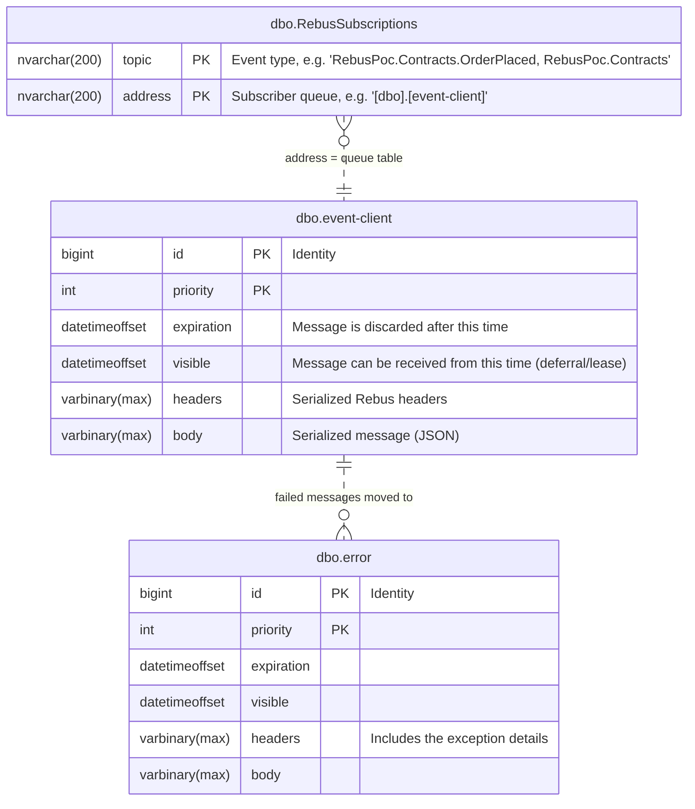
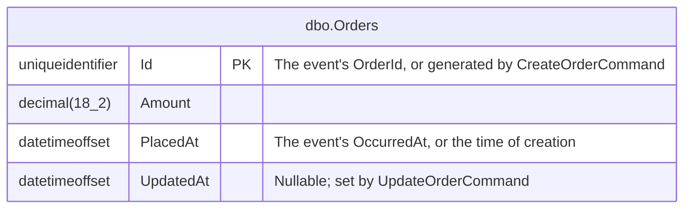

# Rebus POC – SQL Server transport

A small .NET 10 proof of concept that runs [Rebus](https://github.com/rebus-org/Rebus) publish/subscribe over the SQL Server transport. SQL Server runs in a [Testcontainer](https://testcontainers.com/modules/mssql/).

The subscriber stores every event it receives as an order with EF Core. It also offers an Orders API over JSON-RPC, built on MediatR commands and queries. Both the events and the API go through the same command handlers and the same transaction behavior.

## Projects

| Project | Purpose |
| --- | --- |
| `src/RebusPoc.Contracts` | Shared event types (`OrderPlaced`). The provider and client both reference it. |
| `src/RebusPoc.EventProvider` | Publishes an `OrderPlaced` event every 2 seconds. It's a one-way client with no input queue. |
| `src/RebusPoc.EventClient` | A web app on `http://localhost:5080`. It subscribes to `OrderPlaced` on the `event-client` queue, stores each event as an order, and hosts the Orders JSON-RPC API. |
| `src/RebusPoc.AppHost` | Launcher. It starts the SQL Server container, then starts the client and the provider. It passes the Rebus connection string to both and the Orders connection string to the client. |

### EventClient layout

| Folder / file | Contents |
| --- | --- |
| `Program.cs` | Wires up EF Core, MediatR, MediatorEndpoint (with OpenAPI) and Rebus, creates the Orders database, and maps the endpoints. |
| `Endpoints/JsonRpcEndpoint.cs` | The `POST /jsonrpc` endpoint, which sends JSON-RPC calls to MediatR. |
| `Messaging/ICommand.cs` | The `ICommand<T>` / `IQuery<T>` marker interfaces for CQRS. |
| `Messaging/TransactionBehavior.cs` | The MediatR pipeline behavior that wraps commands in a transaction. |
| `Orders/` | The `Order` entity, `OrdersDbContext`, `OrderDto`, and the `Commands/` and `Queries/` with their handlers. |
| `OrderPlacedHandler.cs` | The Rebus handler. It turns `OrderPlaced` into a `CreateOrderCommand`. |
| `RebusPoc.EventClient.http` | Sample JSON-RPC requests. |

## How it works

### Pub/sub

- Both apps keep their subscriptions in one shared SQL table, `RebusSubscriptions`. This is Rebus's centralized subscription storage.
- At startup the client subscribes to `OrderPlaced`, which adds a row to that table.
- When the provider publishes, it looks up the subscribers in the table and writes the message straight into each subscriber's queue table (`event-client`).
- Rebus creates the tables it needs automatically.

### CQRS and transactions

The client uses MediatR 12.5, the last Apache-2.0 release.

- Every request implements either `ICommand<T>` (it changes state) or `IQuery<T>` (it only reads). Handlers only change the `DbContext`. They never call `SaveChanges`.
- `TransactionBehavior` wraps every **command** in a `TransactionScope` with the `ReadCommitted` isolation level. It runs the handler, calls `SaveChangesAsync` and completes the scope. If anything throws, the scope is disposed without completing, which rolls the transaction back. Queries skip the behavior.
- EF's `EnableRetryOnFailure` is deliberately off, because EF's retrying execution strategy doesn't support an ambient `TransactionScope`.

### From event to order

`OrderPlacedHandler` sends a `CreateOrderCommand` through `IMediator`. The event therefore goes through the same handler and the same transaction behavior as the `Orders.CreateOrder` JSON-RPC method. The handler sets the command's `Id` and `PlacedAt` from the event's `OrderId` and `OccurredAt`.

If the command fails, the transaction rolls back and Rebus retries the message. After 5 failed attempts Rebus moves the message to the `error` queue. `CreateOrderCommand` is idempotent on the order Id, so an event that arrives twice is safe.

## Orders API (JSON-RPC)

The API is a single [JSON-RPC 2.0](https://www.jsonrpc.org/specification) endpoint, `POST http://localhost:5080/jsonrpc`. It's built on [MediatorEndpoint](https://github.com/christophdebaene/MediatorEndpoint) (NuGet `MediatorEndpoint.JsonRpc`).

At startup the library scans for MediatR requests in the `RebusPoc.EventClient.Orders` namespace and makes each one a method. The method name is `Orders.` plus the type name without its `Command`/`Query` suffix. Whether a method counts as a command or a query comes from the `ICommand`/`IQuery` markers. Startup fails if a request has neither.

| Method | Params | Result |
| --- | --- | --- |
| `Orders.ListOrders` | none | all orders, newest first |
| `Orders.GetOrder` | `{ "id": "..." }` | the order, or `null` |
| `Orders.CreateOrder` | `{ "amount": 42.5 }` | the new order. The command generates the Id, and callers can't set `id` or `placedAt`. |
| `Orders.UpdateOrder` | `{ "id": "...", "amount": 99.99 }` | the updated order, or `null` if not found |
| `Orders.DeleteOrder` | `{ "id": "..." }` | `true`, or `false` if not found |

Example:

```http
POST http://localhost:5080/jsonrpc
Content-Type: application/json

{ "id": "1", "jsonrpc": "2.0", "method": "Orders.CreateOrder", "params": { "amount": 42.5 } }
```

```json
{ "id": "1", "jsonrpc": "2.0", "result": { "id": "3dfdddb9-...", "amount": 42.5, "placedAt": "2026-10-07T10:52:53+00:00", "updatedAt": null } }
```

Errors come back as JSON-RPC error objects, with HTTP status 200:

| Code | When |
| --- | --- |
| `-32600` | Invalid request, such as a missing `id`, `jsonrpc` or `method` |
| `-32601` | Unknown method |
| `-32602` | Invalid params: malformed params, or an `ArgumentException` from a handler, such as a negative amount |
| `-32603` | Any other exception |

Batch requests (a JSON array of calls) aren't supported. `src/RebusPoc.EventClient/RebusPoc.EventClient.http` has a sample request for every method.

### OpenAPI

`GET http://localhost:5080/openapi` returns an OpenAPI 3 document for all methods. Add `?format=yaml` to get YAML instead of JSON. The document is generated by `MediatorEndpoint.JsonRpc.OpenApi` from the same method list as the endpoint, so it always matches the code. The request schema for each method is the JSON-RPC envelope with that method's `params`. `[JsonIgnore]` properties such as `CreateOrderCommand.Id` don't appear.

The library documents each method as its own path, for example `POST /Orders/CreateOrder` for `Orders.CreateOrder`. Those paths are documentation only: every real call goes to `POST /jsonrpc`. Because of this, "try it out" in tools such as Swagger UI won't work against the document as it stands.

## Prerequisites

- [.NET 10 SDK](https://dotnet.microsoft.com/download)
- A running Docker engine, for example Docker Desktop. The first run pulls `mcr.microsoft.com/mssql/server:2022-latest`, which takes a while.

## Run everything with the AppHost

```bash
dotnet build RebusPoc.slnx
dotnet run --project src/RebusPoc.AppHost
```

The AppHost starts apps with `dotnet run --no-build`, so **build the solution first** every time you change code.

Expected output (shortened):

```text
[apphost] Starting SQL Server container...
[apphost] SQL Server ready: Server=127.0.0.1,xxxxx;...
[client] Subscribed to OrderPlaced
[client]       Now listening on: http://localhost:5080
[provider]       Published OrderPlaced b2048b73-... (98.31)
[client]       Received OrderPlaced b2048b73-... (98.31) at ...
[client]       Committed transaction for CreateOrderCommand
```

The client starts about 5 seconds before the provider. Events published before a subscription exists are dropped, which is normal for pub/sub.

Press **Ctrl+C** to stop. The AppHost stops both apps and deletes the container, so the orders don't survive a restart.

## Run the apps individually

Both apps read the Rebus connection string from `ConnectionStrings:Rebus`. The client also needs `ConnectionStrings:Orders` and creates that database if it doesn't exist. You can supply both as environment variables and point them at any SQL Server, such as the one the AppHost prints or a local instance:

```bash
export ConnectionStrings__Rebus="Server=localhost,1433;Database=master;User Id=sa;Password=<password>;TrustServerCertificate=True"
export ConnectionStrings__Orders="Server=localhost,1433;Database=Orders;User Id=sa;Password=<password>;TrustServerCertificate=True"

dotnet run --project src/RebusPoc.EventClient     # terminal 1
dotnet run --project src/RebusPoc.EventProvider   # terminal 2
```

The client listens on `http://localhost:5080`, which is set in `src/RebusPoc.EventClient/appsettings.json`.

Start more than one client by giving each a different queue name and port. The queue name is currently hard-coded as `event-client` in `src/RebusPoc.EventClient/Program.cs`. Every subscriber then gets its own copy of each event.

## Database schema

### Rebus (`master`)

Rebus creates these tables in `master` (schema `dbo`) when the apps start:



- **`RebusSubscriptions`** has one row per (event type, subscriber queue) pair, and its primary key is `(topic, address)`. `EventClient` adds the row when it calls `Subscribe<OrderPlaced>()`. When `EventProvider` publishes, it reads the rows for that topic and puts a copy of the message into each `address` queue.
- **`event-client`** is the client's input queue. Every Rebus queue table has these same columns. The clustered primary key is `(priority, id)`. There are also two indexes: `IDX_RECEIVE` on `(priority, visible, id, expiration)` makes receiving fast, and `IDX_EXPIRATION` makes cleaning up expired messages fast.
- **`error`** is the error queue and has the same layout as a queue table. Rebus moves a message here after it fails 5 delivery attempts. Its `headers` hold the exception details.

The relations are **logical only**: none of these tables have foreign keys. `RebusSubscriptions.address` holds the *name* of a queue table, and a message gets into `error` by being moved there, not through a reference. Each new subscriber queue adds its own queue table and its own rows in `RebusSubscriptions`.

### Orders (`Orders`)

At startup `EventClient` creates the `Orders` database with EF Core's `EnsureCreated`. It has a single table:



The schema isn't migrated. `EnsureCreated` only creates the database when it doesn't exist yet. With the AppHost, the database is recreated on every run.

## Inspecting the database

While the AppHost is running, connect to the printed connection string with any SQL client (Azure Data Studio, DBeaver, `sqlcmd`, ...) and look at:

- `master.dbo.RebusSubscriptions`: which queue subscribes to which event type
- `master.dbo.[event-client]`: the client's input queue (normally empty, because messages are taken right away)
- `master.dbo.error`: messages that failed to process
- `Orders.dbo.Orders`: the orders, from both events and JSON-RPC calls
