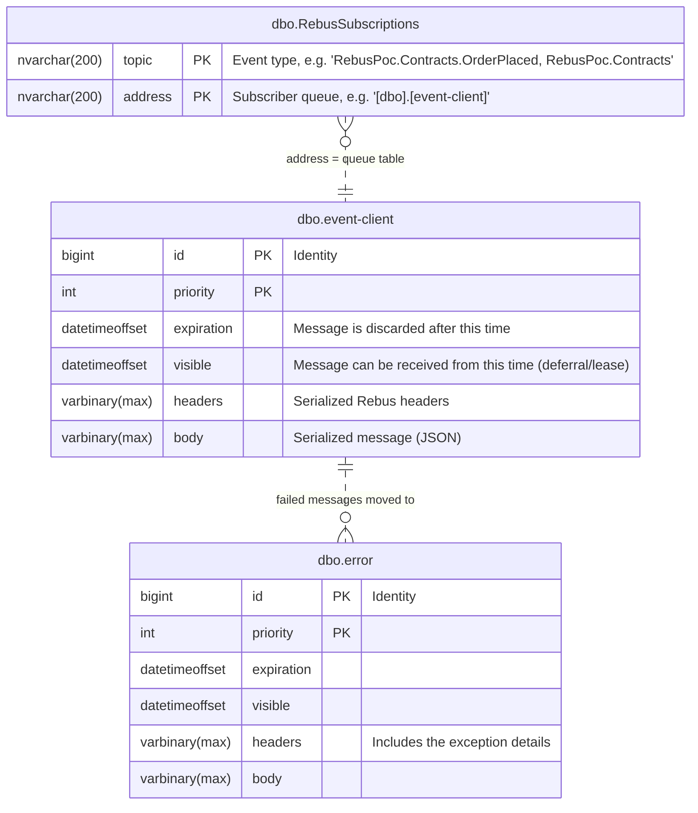

# Rebus POC – SQL Server transport

A small .NET 10 proof of concept that runs [Rebus](https://github.com/rebus-org/Rebus) publish/subscribe over the SQL Server transport. SQL Server runs in a [Testcontainer](https://testcontainers.com/modules/mssql/).

## Projects

| Project | Purpose |
| --- | --- |
| `src/RebusPoc.Contracts` | Shared event types (`OrderPlaced`). The provider and client both reference it. |
| `src/RebusPoc.EventProvider` | Publishes an `OrderPlaced` event every 2 seconds. It's a one-way client with no input queue. |
| `src/RebusPoc.EventClient` | Subscribes to `OrderPlaced` and stores every event it receives as an order. It reads from the `event-client` queue and also hosts the Orders CRUD API. |
| `src/RebusPoc.AppHost` | Launcher. It starts the SQL Server container, then starts the client and the provider with the connection string. |

## How it works

- Both apps keep their subscriptions in one shared SQL table, `RebusSubscriptions`. This is Rebus's centralized subscription storage.
- At startup the client subscribes to `OrderPlaced`, which adds a row to that table.
- When the provider publishes, it looks up the subscribers in the table and writes the message straight into each subscriber's queue table (`event-client`).
- Rebus creates the tables it needs automatically.

## Orders API (EventClient)

`EventClient` is also a web app on `http://localhost:5080`. It stores orders with EF Core in a separate `Orders` database on the same SQL Server. The database is created at startup with `EnsureCreated`, and the AppHost passes its connection string as `ConnectionStrings__Orders`.

| Method | Route | Request | Result |
| --- | --- | --- | --- |
| `GET` | `/orders` | `ListOrdersQuery` | 200 with all orders |
| `GET` | `/orders/{id}` | `GetOrderQuery` | 200 / 404 |
| `POST` | `/orders` `{ "amount": 42.5 }` | `CreateOrderCommand` | 201 with Location |
| `PUT` | `/orders/{id}` `{ "amount": 99.99 }` | `UpdateOrderCommand` | 200 / 404 |
| `DELETE` | `/orders/{id}` | `DeleteOrderCommand` | 204 / 404 |

`src/RebusPoc.EventClient/RebusPoc.EventClient.http` has sample requests.

The API follows CQRS with MediatR 12.5 (the last Apache-2.0 release):

- Requests implement either `ICommand<T>` or `IQuery<T>` (`Messaging/ICommand.cs`). Handlers only change the `DbContext`. They never call `SaveChanges`.
- `TransactionBehavior` (`Messaging/TransactionBehavior.cs`) wraps every **command** in a `TransactionScope`. It runs the handler, calls `SaveChangesAsync` and completes the scope. If anything throws, the scope is disposed without completing, which rolls back. Queries skip the behavior.
- `OrderPlacedHandler` (Rebus) sends `CreateOrderCommand` through `IMediator`, so an incoming event goes through the same handler and transaction as `POST /orders`. When the command fails, the transaction rolls back and Rebus retries the message. `CreateOrderCommand` is idempotent on the order Id, so redelivered events are safe.

## Prerequisites

- [.NET 10 SDK](https://dotnet.microsoft.com/download)
- A running Docker engine, for example Docker Desktop. The first run pulls `mcr.microsoft.com/mssql/server:2022-latest`, which takes a while.

## Run everything with the AppHost

```bash
dotnet build RebusPoc.slnx
dotnet run --project src/RebusPoc.AppHost
```

The AppHost starts apps with `dotnet run --no-build`, so **build the solution first** every time you change code.

Expected output (shortened):

```text
[apphost] Starting SQL Server container...
[apphost] SQL Server ready: Server=127.0.0.1,xxxxx;...
[client] Subscribed to OrderPlaced
[provider]       Published OrderPlaced b2048b73-... (98.31)
[client]       Received OrderPlaced b2048b73-... (98.31) at ...
```

The client starts about 5 seconds before the provider. Events published before a subscription exists are dropped, which is normal for pub/sub.

Press **Ctrl+C** to stop. The AppHost stops both apps and deletes the container.

## Run the apps individually

The provider and client read their connection string from `ConnectionStrings:Rebus`. You can supply it with the `ConnectionStrings__Rebus` environment variable, and point it at any SQL Server, such as the one the AppHost prints or a local instance:

```bash
export ConnectionStrings__Rebus="Server=localhost,1433;Database=master;User Id=sa;Password=<password>;TrustServerCertificate=True"

dotnet run --project src/RebusPoc.EventClient     # terminal 1
dotnet run --project src/RebusPoc.EventProvider   # terminal 2
```

Start more than one client by giving each a different queue name. The queue name is currently hard-coded as `event-client` in `src/RebusPoc.EventClient/Program.cs`. Every subscriber then gets its own copy of each event.

## Database schema

Rebus creates these tables in `master` (schema `dbo`) when the apps start:



- **`RebusSubscriptions`** has one row per (event type, subscriber queue) pair, and its primary key is `(topic, address)`. `EventClient` adds the row when it calls `Subscribe<OrderPlaced>()`. When `EventProvider` publishes, it reads the rows for that topic and puts a copy of the message into each `address` queue.
- **`event-client`** is the client's input queue. Every Rebus queue table has these same columns. The clustered primary key is `(priority, id)`. There are also two indexes: `IDX_RECEIVE` on `(priority, visible, id, expiration)` makes receiving fast, and `IDX_EXPIRATION` makes cleaning up expired messages fast.
- **`error`** is the error queue and has the same layout as a queue table. Rebus moves a message here after it fails 5 delivery attempts. Its `headers` hold the exception details.

The relations are **logical only**: none of these tables have foreign keys. `RebusSubscriptions.address` holds the *name* of a queue table, and a message gets into `error` by being moved there, not through a reference. Each new subscriber queue adds its own queue table and its own rows in `RebusSubscriptions`.

## Inspecting the database

While the AppHost is running, connect to the printed connection string with any SQL client (Azure Data Studio, DBeaver, `sqlcmd`, ...) and look at:

- `dbo.RebusSubscriptions`: which queue subscribes to which event type
- `dbo.[event-client]`: the client's input queue (normally empty, because messages are taken right away)
- `dbo.error`: messages that failed to process
